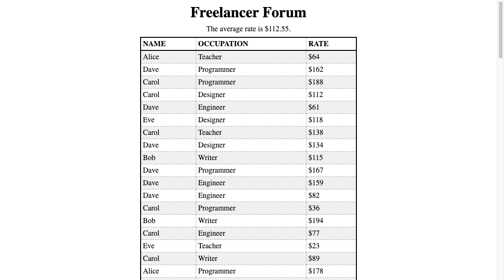

# Freelancer Forum



You've been contracted to build an online platform for freelancers to advertise their services. Visitors to this website can find a list of freelancers which includes their names, occupations, and hourly rates. At the top of the website is also a message indicating the average hourly rate of all freelancers.

## Instructions

Write code according to the provided prompts. You are highly encouraged to review previous solutions!

1. Write a function that returns a freelancer object with a randomly generated name, occupation, and rate according to the provided constants.
2. Initialize a state variable to an array of `NUM_FREELANCERS` freelancer objects.
3. Write a function that returns the average rate of all freelancers in state.
4. Use that function to initialize a state variable which will store the average rate of all freelancers.
5. Write a component function to represent a single freelancer.
6. Write a component function to represent an array of freelancers.
7. Write a component function to represent the average rate of all freelancers.
8. Write and call a render function that will mount the application onto the document.

> [!NOTE]
>
> You have a lot of creative freedom as to what the components actually are, as long as they are properly mounted and render all of the necessary information!

> [!WARNING]
>
> If you're thinking about using a `<table>`, be aware that
> you aren't allowed to use "fake" elements in a table!
> So when you render your app, replace a real element with an ID instead of
> replacing a `<Component></Component>`.
>
> ```js
> $app.innerHTML = `
>    <tbody id="FreelancerRows"></tbody>
> `;
> $app.querySelector("#FreelancerRows").replaceWith(FreelancerRows());
> ```

## Submission

Please submit the link to your public GitHub repository.
